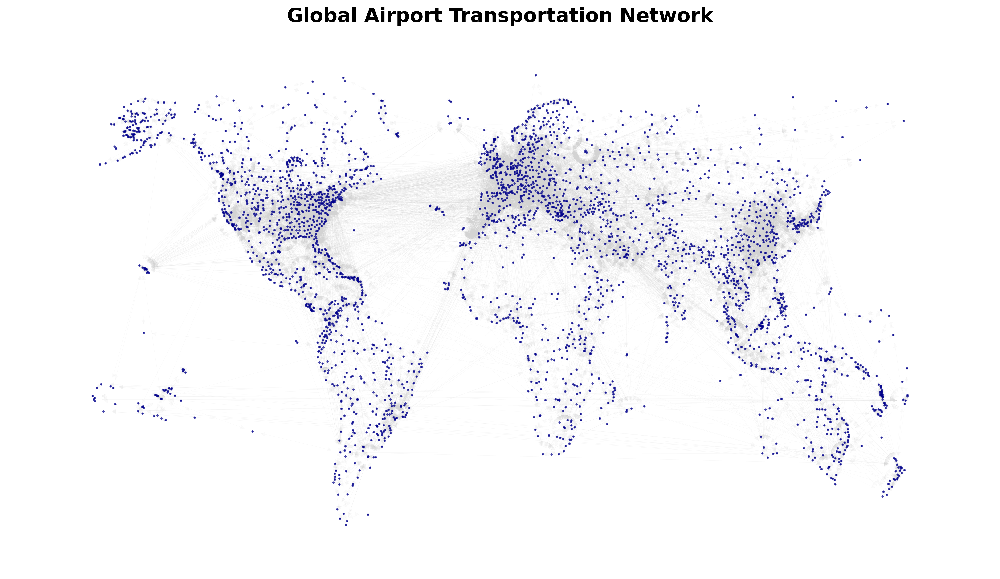
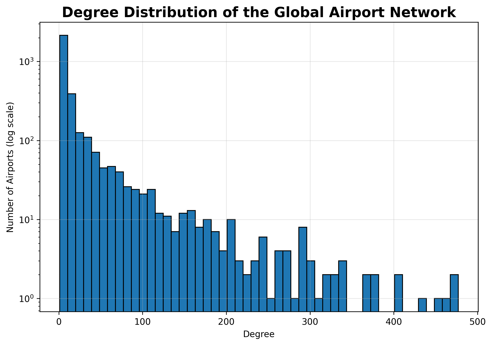
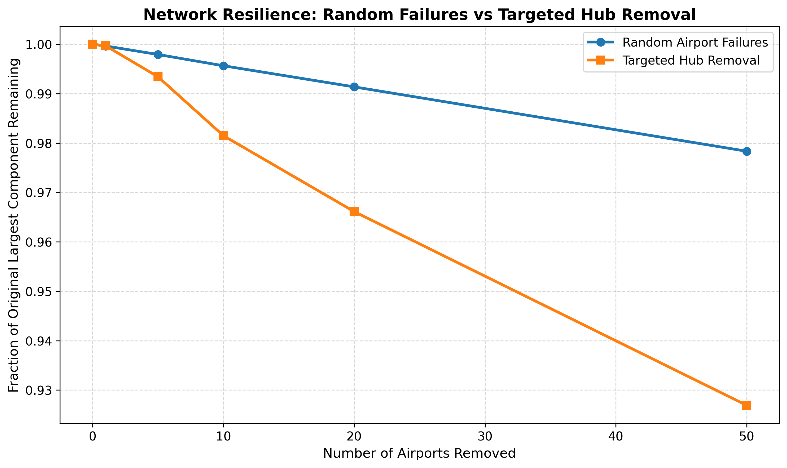
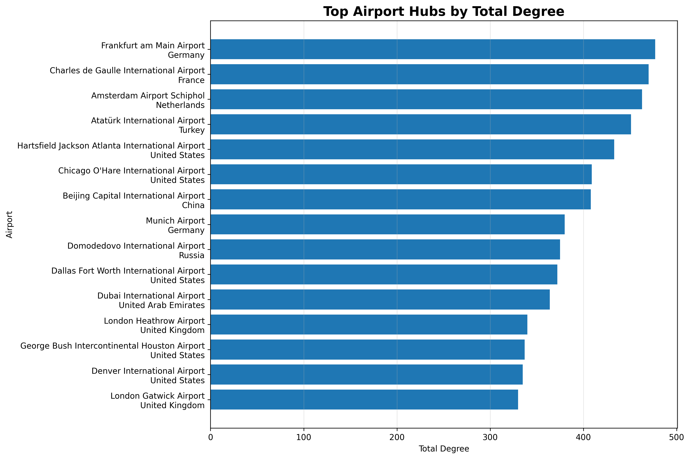

# Global Airport Network Analysis



## Project Overview

The global air transportation system is one of the largest and most complex infrastructure networks in the world. Understanding its structural organization and resilience is essential for transportation planning, infrastructure protection, and disruption management.

This project models the worldwide airport transportation system as a directed graph using the OpenFlights dataset, where airports are represented as nodes and scheduled flight routes as directed edges. Graph theory and network science techniques are then applied to investigate the network's structural properties, identify globally important hub airports, detect community structure, visualize geographical connectivity, and evaluate network resilience under different airport failure scenarios.

The project is implemented entirely in Python using NetworkX, Pandas, NumPy, and Matplotlib, following a modular workflow that progresses from data exploration and graph construction to advanced network analysis.

## Table of Contents

- [Project Overview](#project-overview)
- [Research Question](#research-question)
- [Objectives](#objectives)
- [Dataset](#dataset)
- [Methodology](#methodology)
- [Key Results](#key-results)
- [Technologies Used](#technologies-used)
- [How to Run](#how-to-run)
- [Notebook Workflow](#notebook-workflow)
- [Resilience Analysis](#resilience-analysis)
- [Community Detection](#community-detection)
- [Project Structure](#project-structure)
- [Future Work](#future-work)
- [Author](#author)

## Research Question

**How is the global airport transportation network structurally organized, which airports are most critical for maintaining worldwide connectivity, and how resilient is the network to different airport failure scenarios?**


## Objectives

- Construct a global airport-route network from real-world data.
- Analyse the structural properties of the network.
- Identify highly connected and structurally important airports.
- Detect communities within the global airport network.
- Compare network response to random and targeted airport failures.
- Examine whether airports with high degree centrality and betweenness centrality play different structural roles.

## Notebook Workflow

Run the notebooks in the following order from the `Notebooks` folder:

1. `01_Data_Exploration.ipynb` — dataset structure and data-quality checks.
2. `02_Graph_Construction.ipynb` — directed airport-route network construction and validation.
3. `03_Basic_Network_Analysis.ipynb` — network-level metrics and degree-based analysis.
4. `04_Centrality_Analysis.ipynb` — degree, PageRank, and betweenness centrality.
5. `05_Geographic_Visualization.ipynb` — geographic distribution of airports and major hubs.
6. `06_Communities_and_Resilience.ipynb` — community detection, random failures, targeted hub failures, and resilience analysis.

## Methodology

The project follows a structured graph-theoretic workflow, progressing from data preprocessing to advanced network analysis.

The principal methods used include:

* **Graph Construction** – Building a directed airport-route network using NetworkX.
* **Network Statistics** – Computing global network metrics including density, reciprocity, connected components, and degree distribution.
* **Centrality Analysis** – Identifying structurally important airports using Degree, PageRank, and Betweenness Centrality.
* **Geographic Visualization** – Mapping airport locations and major hubs to examine the spatial organization of the network.
* **Community Detection** – Applying the Louvain algorithm to identify densely connected airport communities.
* **Network Resilience Analysis** – Comparing the effects of random failures, degree-targeted attacks, and betweenness-targeted attacks by measuring changes in the largest connected component.

Together, these methods provide a comprehensive understanding of both the structural organization and robustness of the global airport transportation network.

## Key Results

The analysis reveals several important structural characteristics of the global airport transportation network:

- The network contains **3,214 airports** connected by **36,907 directed flight routes**, forming one dominant connected component.
- The airport network is **highly sparse**, with only a small fraction of all possible airport-to-airport connections existing in practice.
- A relatively small number of airports act as global hubs, with airports such as **Frankfurt**, **Charles de Gaulle**, and **Amsterdam Schiphol** ranking among the most connected.
- Centrality analysis demonstrates that different measures (Degree, PageRank, and Betweenness Centrality) identify different types of structurally important airports.
- Community detection reveals geographically meaningful groups of airports, reflecting regional aviation structure.
- Resilience analysis shows that the network is highly robust to random airport failures but significantly more vulnerable when strategically important hub airports are removed.

## Sample Visualizations

### Global Airport Network


### Degree Distribution



### Network Resilience

 HEAD
V


### Top 20 hubs




## Technologies Used

| Category | Tools |
|----------|-------|
| Programming Language | Python |
| Data Processing | Pandas, NumPy |
| Network Analysis | NetworkX |
| Community Detection | python-louvain |
| Visualization | Matplotlib |
| Development Environment | Jupyter Notebook, VS Code |
| Version Control | Git, GitHub |

## How to Run

### 1. Clone the repository

```bash
git clone <repository-url>
cd global-airport-network-analysis
```

### 2. Install dependencies

```bash
pip install -r requirements.txt
```

### 3. Launch Jupyter Notebook

```bash
jupyter notebook
```

### 4. Run the notebooks in the following order

1. `01_Data_Exploration.ipynb`
2. `02_Graph_Construction.ipynb`
3. `03_Basic_Network_Analysis.ipynb`
4. `04_Centrality_Analysis.ipynb`
5. `05_Geographic_Visualization.ipynb`
6. `06_Communities_and_Resilience.ipynb`


## Resilience Analysis

Two types of failure scenarios are considered.

### Random failures

Airports are removed randomly at different failure levels. The experiment is repeated across multiple trials to reduce dependence on one particular random selection.

### Targeted failures

Airports are removed according to structural importance, using:

- degree centrality
- betweenness centrality

The size of the largest connected component is then measured after each removal level.

This provides a structural comparison between random failures and targeted disruption of important network nodes.

> These simulations represent graph-theoretic failure scenarios and are not predictions of actual aviation disruptions.

## Community Detection

The Louvain algorithm is used to identify groups of airports with comparatively dense internal connectivity.

The resulting communities reveal strong geographic and regional structure in the global airport network.

## Project Structure

```text
global-airport-network-analysis/
│
├── Data/
│   ├── airports.dat
│   └── routes.dat
│
├── Notebooks/
│   ├── 01_Data_Exploration.ipynb
│   ├── 02_Graph_Construction.ipynb
│   ├── 03_Basic_Network_Analysis.ipynb
│   ├── 04_Centrality_Analysis.ipynb
│   ├── 05_Geographic_Visualization.ipynb
│   └── 06_Communities_and_Resilience.ipynb
│
├── Figures/
│
├── Reports/
│
├── src/
│   ├── graph_builder.py
│   └── run_analysis.py
│
├── README.md
├── requirements.txt
└── .gitignore
```
## Future Work

Potential extensions of this project include:

- Incorporating flight frequency and passenger traffic as weighted edges.
- Studying temporal changes in the airport network across multiple years.
- Comparing network resilience under different disruption strategies.
- Evaluating the impact of regional airport closures on global connectivity.
- Applying additional graph embedding and machine learning techniques for airport importance prediction.


## Author

**Himanshi Pandey**

M.Sc. Applied Mathematics  
National Institute of Technology Warangal

This project investigates the structural organization and resilience of the global airport transportation network using graph theory and network science techniques.
